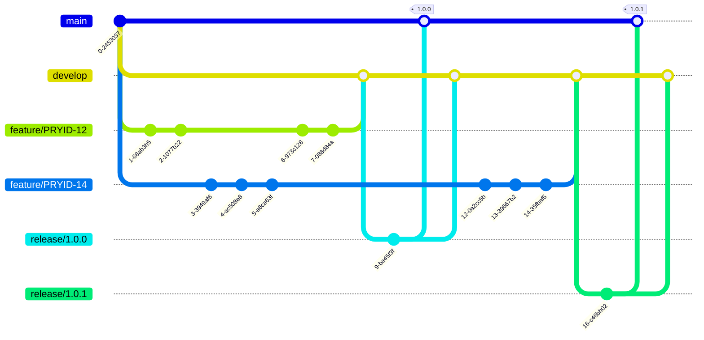

```mermaid
gitGraph
  commit
  branch develop
  branch feature/PRYID-12
  commit
  commit
  checkout develop
  branch feature/PRYID-14
  commit
  commit
  commit
  checkout feature/PRYID-12
  commit
  commit
  checkout develop
  merge feature/PRYID-12
  branch release/1.0.0
  commit
  checkout main
  merge release/1.0.0 tag: "1.0.0"
  checkout develop
  merge release/1.0.0
  checkout feature/PRYID-14
  commit
  commit
  commit
  checkout develop
  merge feature/PRYID-14
  branch release/1.0.1
  commit
  checkout main
  merge release/1.0.1 tag: "1.0.1"
  checkout develop
  merge release/1.0.1
```
